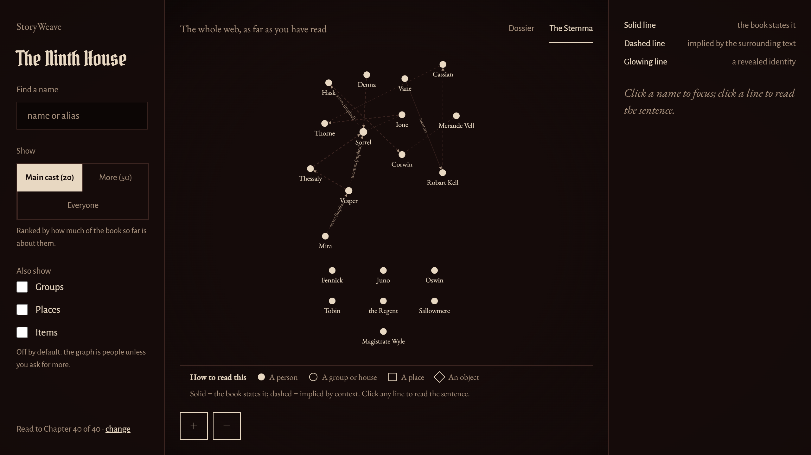
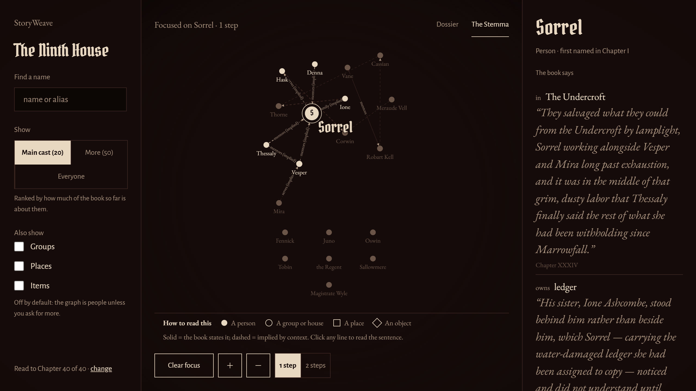
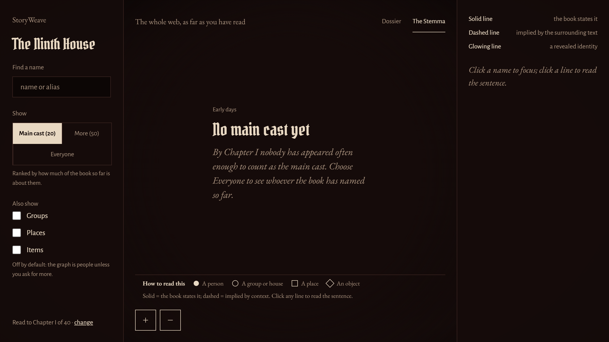

# StoryWeave

[](https://github.com/Shashank-ssls/StoryWeave/actions/workflows/ci.yml)
[](LICENSE)
[](pyproject.toml)

> A spoiler-aware knowledge engine for web novels — a living, chapter-fenced knowledge graph that only ever shows you what you’ve already read.

StoryWeave ingests the chapters of a web novel and builds a **knowledge graph** of the
story — characters, places, organizations, items, abilities, concepts, events, and titles
as nodes; typed relationships as edges — together with a **spoiler-aware semantic search**.
Its defining principle: **the graph models what the reader has been told by chapter N, not
the objective truth of the world.** A chapter slider drives this reading position, and the
graph *blooms* as you advance — a secret identity, a hidden allegiance, or a late twist
appears on the exact chapter the text reveals it, and never before.

---

## ⚠️ Disclaimer

- **Personal / portfolio project.** Built as a learning and demonstration project, provided
  **as-is** with no warranty (see [LICENSE](LICENSE)).
- **No copyrighted text is distributed.** The repo ships **only one original, CC0-licensed
  sample novel** (*The Hollow Crown*, under `data/samples/the-hollow-crown/`). Any real
  web-novel text you analyze stays in a **local, git-ignored** folder (`data/raw/`) and is
  never committed, uploaded, or transmitted. Respect the copyright and terms of service of
  any source you use.
- **Output is automated and imperfect.** Entities and relationships come from zero-shot NER
  (GLiNER) and an optional local LLM — a best-effort reconstruction of reader-knowledge, not
  a curated wiki (see [Scope & limitations](#scope--limitations)).
- **Local-first and private by default.** Nothing leaves your machine. The optional LLM
  layer is **off by default**; with it off there are **zero outbound network calls** at
  runtime.
- **Not affiliated** with any author, translator, or publisher.

---

## What it does

- **Spoiler fence (the core idea).** Every node, edge, and significant property carries a
  `revealed_chapter`. A single query chokepoint hides anything the reader hasn’t reached at
  chapter N — enforced at the database/index level, never as a fragile post-filter.
- **8-type ontology, rich edges.** `Character · Place · Organization · Item · Ability ·
  Concept · Event · Title`, with subtypes and **three tiers of relationships**: structural
  (rule-based floor), social (optional LLM), identity (`SAME_AS`, `ALIAS`, `SECRET_IDENTITY`,
  `REINCARNATION`, `TRANSMIGRATED_INTO`).
- **GLiNER floor, LLM enhancement.** A complete, useful graph is produced with **zero LLM**.
  The optional local LLM only *adds* social and identity edges, and degrades gracefully to
  the floor when unavailable.
- **Fenced semantic search**, an **interactive React + Cytoscape UI** (chapter slider with
  bloom, degree filter, salience demotion, type isolation, path-finding, evidence panel),
  and **provenance** (extraction method + evidence span) on every element.

---

## Measured results (retrofit v2, branch `retrofit/v2-core`)

**StoryWeave reads a novel and builds a graph of who is who and how they are connected,
where every node and edge carries the chapter at which a *reader* learns it. Ask it
anything at chapter *n* and it answers with only what a reader at chapter *n* could know —
enforced in one SQL chokepoint, not by hiding things in the browser. Every relationship it
draws comes with the book's own sentence as its citation, or it is not drawn.**

Full evaluation: [`evidence/retrofit/EVAL_RETROFIT.md`](evidence/retrofit/EVAL_RETROFIT.md) ·
every pre-registered prediction vs its measurement:
[`evidence/retrofit/PROJECTION_CHECK.md`](evidence/retrofit/PROJECTION_CHECK.md).

### The graph, at chapter 40

| | | |
| --- | --- | --- |
|  |  |  |
| **`desktop_ch40_default.png`** — twenty named people, an always-visible legend, and three controls that change the *payload*, not just the picture. | **`desktop_ch40_panel.png`** — click anyone: the relation in plain words and the book's own sentence, with its chapter. | **`desktop_ch1_low_edges.png`** — chapter 1: "No main cast yet". The system declining to show what it has not earned. |

All 15 screenshots (desktop + phone, chapters 10/20/40, default and "Everyone") are in
[`evidence/retrofit/shots/R7/`](evidence/retrofit/shots/R7/), with the DOM counts behind
every one in `capture_log.txt`.

### Headline numbers — all [MEASURED]

| quantity | v1 | after the retrofit |
| --- | ---: | ---: |
| **spoiler-fence violations** | 0 / 105,243 elements | **0 / 28,869** over 12,660 queries, both negative controls firing |
| relation false positives (v1 answer key) | 162 | **7** |
| relation micro-F1 (v1 answer key) | 0.0459 | **0.0000** |
| entity F1 (v1 8-type key) | 0.5319 | **0.5682** |
| entity F1 (4-type key, its own) | — | **0.6250** |
| alias F1 / **over-merges** | — | **0.7500** / **0** |
| default view at chapter 40 | 152 dots / 976 lines | **20 / 18** |
| median `/graph` at chapter 40 | 28.2 ms | **11.3 ms** |

**Read that second-to-last row honestly: relation F1 went to zero, and that is the real
result.** All five of v1's "true positives" came from a co-occurrence rule that emitted
1,307 edges to catch 5 — and caused 160 of the 162 false positives. Deleting it deleted
them. Five phases then traced exactly why the replacement finds so little: the endpoints
that go missing are **pronouns**. English writes *"she had served the house since before
the fire"*, and a citation rule that demands both names in one sentence rejects a true
relationship because of the word "she". Coreference resolution is the top item of future
work, and the reasoning is in `EVAL_RETROFIT.md` §4.

What did work: the fence is provable at forty chapters across thirteen surfaces, over-merges
of separate identities have never occurred, and the graph went from 976 unlabelled lines to
18 labelled ones that a non-technical reader can actually follow.

### Running the demo

```powershell
.\dev.ps1                                  # activates .venv, pins every cache inside the repo
python tools/check_local_env.py            # must print PASS before anything else
storyweave seed-demo --no-ninth-house      # seeds the CC0 sample novel
python -m uvicorn storyweave.api.app:app --port 8000
cd frontend; npm install; npm run dev      # http://localhost:5173
```

To browse the evaluated Ninth House graph instead, point the API at it first:
`$env:STORYWEAVE_DB_PATH = "data/retrofit/ninth_house_r6.db"`.

---

## How a fresh clone behaves

The clone gives you all the **source code** plus the **CC0 sample novel**. Several things are
intentionally **git-ignored** and are recreated locally — so a clone is small and contains no
weights, databases, or copyrighted text:

| Not in the clone (git-ignored) | How it comes back |
| --- | --- |
| `.venv/`, `.venv-ml/` (virtual envs) | you create them (steps below) |
| `*.sqlite` (databases) | `storyweave seed-demo` / `storyweave ingest` rebuild them |
| `.hf-cache/` (GLiNER + embedding weights) | auto-downloads on first `extract` / `index` (needs internet) |
| `tools/`, `.llm-cache/` (LLM runner + model weights) | only for the **optional** LLM layer — set up separately |
| `node_modules/`, `frontend/dist/` | `npm install` / `npm run build` |
| `data/raw/` (your own novels) | you add your own text |

**The fastest path (the demo) needs no ML and no downloads** — only the light Python env and
Node. The full novel-analysis pipeline adds the ML env (and downloads model weights on first
run). The LLM layer is optional on top of that.

---

## Setup — step by step

This reproduces a complete local install (the same layout the project is developed on).
Steps **1–3 + 6** are enough for the demo; add **4** to analyze your own novels; add **5**
for the optional LLM layer.

### Prerequisites
- **Git**
- **Python 3.12+** for the light app (the reference machine uses 3.14; any 3.12+ works)
- **Python 3.12** specifically for the ML pipeline (torch/GLiNER wheels target 3.12)
- **Node.js 18+** (20 recommended) for the frontend
- *(optional, ML)* ~3 GB free disk for model weights; CPU is sufficient — a 4 GB GPU is optional
- *(optional, LLM)* [Ollama](https://ollama.com) (or any OpenAI-compatible local runner)

> **Tip (large files off your system drive):** model weights are big. The app already caches
> HuggingFace weights to a git-ignored `.hf-cache/` **inside the project**. If your project
> lives on a data drive (e.g. `D:`/`F:`), all weights stay off `C:` automatically. For the
> LLM runner, point `OLLAMA_MODELS` at a folder on the same drive (step 5).

### 1. Clone
```bash
git clone https://github.com/Shashank-ssls/StoryWeave.git
cd StoryWeave
```

### 2. Light environment (`.venv`) — app, CLI, tests
```bash
# Windows (PowerShell)
py -V:3.14 -m venv .venv          # or:  py -3.12 -m venv .venv
.venv\Scripts\activate
pip install -e ".[dev]"

# macOS / Linux
python3.12 -m venv .venv
source .venv/bin/activate
pip install -e ".[dev]"
```
Verify:
```bash
storyweave version          # prints the version
storyweave info             # shows config (confirms the LLM layer is OFF by default)
pytest                      # 120+ tests; ML-only tests skip here
ruff check . && mypy        # lint + strict type-check
```

### 3. Frontend
```bash
cd frontend
npm install
cd ..
```

### 4. ML environment (`.venv-ml`) — only to analyze your own novels
```bash
# Windows
py -3.12 -m venv .venv-ml
.venv-ml\Scripts\python -m pip install -U pip
.venv-ml\Scripts\python -m pip install -e .
.venv-ml\Scripts\python -m pip install torch --index-url https://download.pytorch.org/whl/cpu
.venv-ml\Scripts\python -m pip install -r requirements-ml.txt
```
```bash
# macOS / Linux
python3.12 -m venv .venv-ml
.venv-ml/bin/pip install -U pip
.venv-ml/bin/pip install -e .
.venv-ml/bin/pip install torch --index-url https://download.pytorch.org/whl/cpu
.venv-ml/bin/pip install -r requirements-ml.txt
```
GLiNER + embedding weights download to `.hf-cache/` on first `extract` / `index`.

### 5. Optional LLM layer (Ollama) — see [The optional LLM layer](#the-optional-llm-layer-tier-2--tier-3) for full details
```bash
# install Ollama (ollama.com), then — to keep weights off C: — point it at a data drive:
#   PowerShell:  $env:OLLAMA_MODELS = "F:\path\to\StoryWeave\.llm-cache\ollama-models"
#   bash:        export OLLAMA_MODELS="$PWD/.llm-cache/ollama-models"
ollama serve                       # starts the runner on 127.0.0.1:11434
ollama pull qwen2.5:7b             # CPU primary (identity/social)
ollama pull llama3.2:3b            # smaller fallback (fits a 4 GB GPU)
```

### 6. Run the demo (no ML, no downloads)
```bash
# build the deterministic CC0 demo graph
storyweave seed-demo --db storyweave-demo.sqlite

# Terminal 1 — serve the fenced API (light venv)
#   PowerShell:  $env:STORYWEAVE_DB_PATH="storyweave-demo.sqlite"; uvicorn storyweave.api.app:app --port 8000
#   bash:        STORYWEAVE_DB_PATH=storyweave-demo.sqlite uvicorn storyweave.api.app:app --port 8000

# Terminal 2 — run the UI (proxies /api -> :8000)
cd frontend && npm run dev         # open http://localhost:5173
```
Drag the chapter slider: the `SECRET_IDENTITY` edge blooms at chapter 2, `ALIAS` at 3, and
the layered `TRANSMIGRATED_INTO` reveal at 4 — the spoiler fence, made visible.

---

## Running it

### The demo
See step 6 above — the quickest way to see StoryWeave working end-to-end (zero ML, zero
network).

### Your own novel (local pipeline)
Place chapters under `data/raw/<your-novel>/` (one `.txt` per chapter, or a single file with
`Chapter N` headings), then run the pipeline with the **`.venv-ml`** interpreter:
```bash
storyweave ingest data/raw/my-novel --slug my-novel --db my.sqlite   # clean, split, chunk
storyweave extract my-novel --db my.sqlite                           # GLiNER entities (the floor)
storyweave relate  my-novel --db my.sqlite                           # Tier-1 structural edges
storyweave coref   my-novel --db my.sqlite                           # optional: pronoun -> POV merge
storyweave index   my-novel --db my.sqlite                           # embeddings for search
```
Then serve that database and open the UI:
```bash
# PowerShell:  $env:STORYWEAVE_DB_PATH="my.sqlite"; uvicorn storyweave.api.app:app --port 8000
STORYWEAVE_DB_PATH=my.sqlite uvicorn storyweave.api.app:app --port 8000
cd frontend && npm run dev
```
Per-novel knobs (chapter detection, cleaning, POV character for coref, thresholds) live in an
optional `storyweave.toml` beside the text — configuration is **data, never code**. See
`data/samples/the-hollow-crown/storyweave.toml` for an example.

---

## The optional LLM layer (Tier-2 + Tier-3)

The GLiNER floor (entities + structural edges + the reveal fence) is fully functional with no
LLM. The LLM only **adds** Tier-2 **social** relations and Tier-3 **identity** inference (the
“who is secretly whom” reveals) — and it is **OFF by default**. If it’s disabled or the runner
is unreachable, the pipeline degrades cleanly to the floor.

**1. Run a local OpenAI-compatible model server.** The reference setup uses **Ollama**:
```bash
# optional: keep model weights off C: by pointing Ollama at a data-drive folder
export OLLAMA_MODELS="$PWD/.llm-cache/ollama-models"   # PowerShell: $env:OLLAMA_MODELS=...
ollama serve                                           # serves http://127.0.0.1:11434
ollama pull qwen2.5:7b                                 # primary (CPU, ~8 tok/s, leaves VRAM for GLiNER)
ollama pull llama3.2:3b                                # fallback (fits a 4 GB GPU, ~57 tok/s)
```

**2. Tell StoryWeave to use it.** Configuration is via `STORYWEAVE_*` env vars (defaults shown):
```bash
STORYWEAVE_LLM_ENABLED=true                       # the switch — OFF unless set
STORYWEAVE_LLM_BASE_URL=http://127.0.0.1:11434/v1 # OpenAI-compatible endpoint (Ollama default)
STORYWEAVE_LLM_MODEL=qwen2.5:7b                   # or llama3.2:3b
```
(You can also copy `.env.example` to `.env` and edit it.)

**3. Run the enhancement passes** (with the `.venv-ml` interpreter, after `extract`/`relate`):
```bash
storyweave social   my-novel --db my.sqlite                    # Tier-2 social relations
storyweave identity my-novel --db my.sqlite                    # Tier-3 identity inference
storyweave identity my-novel --db my.sqlite --model llama3.2:3b  # use the GPU fallback model
```
Identity edges are **citation-gated and reveal-respecting**: each is written only at the
earliest chapter the model can both conclude the identity *and* quote a confirming line that
actually occurs in chapters 1..k — so a reveal never blooms early. Any compatible endpoint
(Ollama, llama.cpp server, LM Studio, …) works; just point `STORYWEAVE_LLM_BASE_URL` at it.

> **Note:** the runner itself (`tools/`) and its weights (`.llm-cache/`) are git-ignored, so a
> fresh clone does **not** include them — install Ollama and pull the models as above.

---

## Architecture

```
INGESTION   →   EXTRACTION    →   STORES         →   FENCE QUERY LAYER   →   API      →   FRONTEND
clean/split     GLiNER (floor)    SQLite (truth)     the one chokepoint      FastAPI      React +
chunk           + LLM (enhance)   vector store       revealed_chapter <= N                Cytoscape
```

- **SQLite is the source of truth.** The graph projection and vector index are derived and
  fully rebuildable from it.
- **All SQL lives in `storyweave/db/repository.py`** — a single audit point.
- **All spoiler filtering passes through `storyweave/query/fence.py`** — the one enforcement
  chokepoint, keyed on `revealed_chapter`.

Package layout: `storyweave/{config, db, ingest, nlp, graph, search, query, api, cli}`, plus
`frontend/`, `eval/`, `tests/`, and `data/{raw, samples, labels}/`.

---

## Scope & limitations

**In scope:** a local, free, offline-by-default pipeline that turns ingested chapters into a
spoiler-fenced knowledge graph and a chapter-scoped semantic search, with an interactive graph
UI. The design favors **precision over recall** — for a spoiler graph, a *missing* edge is
safer than a *false* one.

**Deliberately out of scope / known limits (measured, not hidden):**

- **It is not a novel reader** and does not redistribute any copyrighted text.
- **Extraction quality is bounded by the models.** On the CC0 sample, Tier-2 social-relation
  recall is ~0.29 (precision 1.00) — many implicit relations need reasoning a small local
  model can’t reliably provide; lifting it was measured and regressed precision, so it was
  not shipped.
- **Identity subtype labels can be imprecise** with a small (7B) local model (e.g.
  transmigration vs. reincarnation), even when the reveal timing and the edge are correct.
- **Coreference is conservative.** First/second/third-person self-reference merges into a
  configured point-of-view character; ambiguous epithets (“the younger soldier”) are left
  unmerged rather than risk corrupting the graph.
- **The LLM layer is optional and unverified across genres.** Several enhancements remain
  gated behind a model larger than the local CPU / 4 GB-GPU target.

The authoritative design lives in [`SPEC.md`](SPEC.md); detailed, dated status and the
measurement log live in [`PROGRESS.md`](PROGRESS.md).

---

## Development

```bash
ruff check .                    # lint
mypy                            # strict type-check
pytest                          # tests (light venv)
cd frontend && npm run build    # frontend type-check + production build
```
CI runs this same gate (ruff · mypy · pytest · frontend build) on every push and PR.

---

## License

[MIT](LICENSE) © Shashank Singhal. The bundled sample novel *The Hollow Crown* is released
under **CC0** (see `data/samples/the-hollow-crown/LICENSE.md`).
