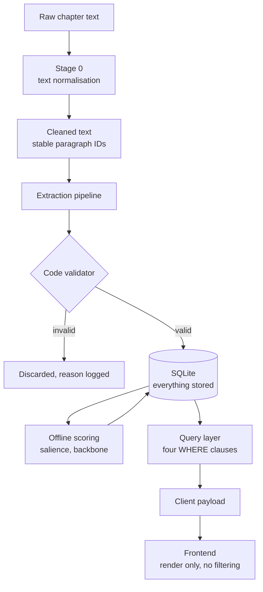
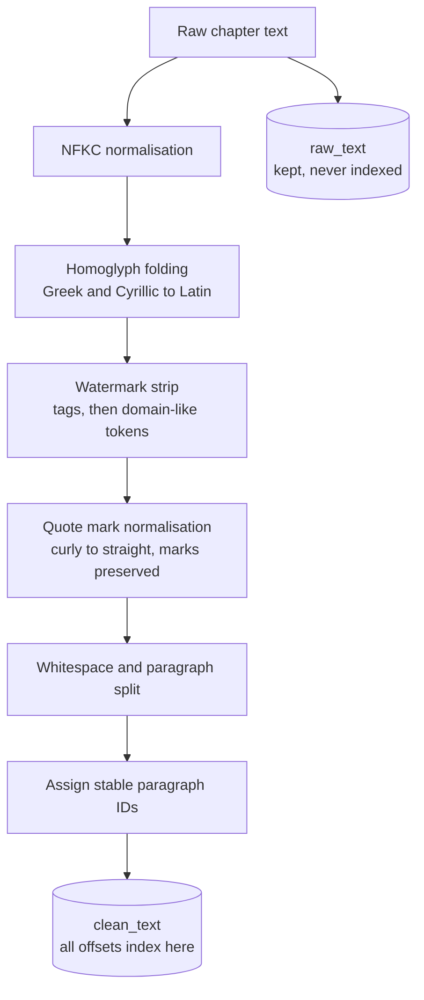
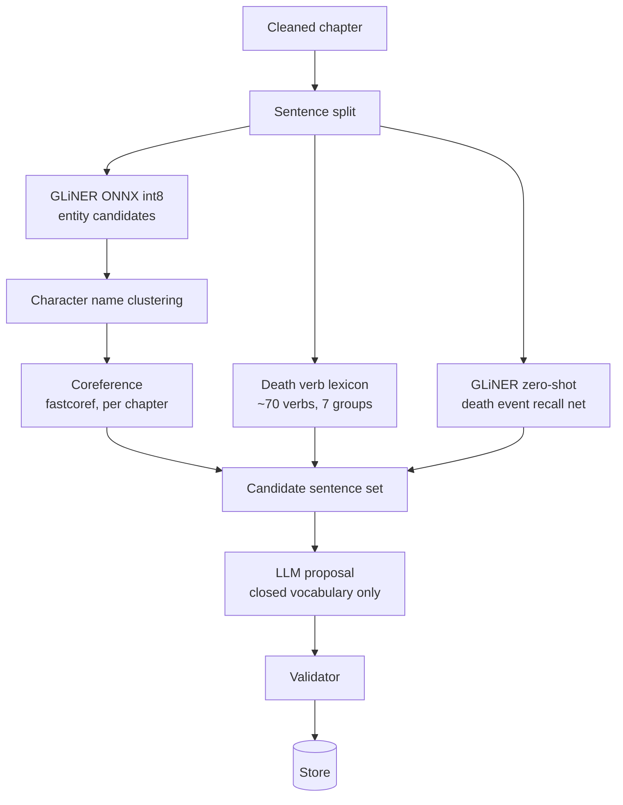
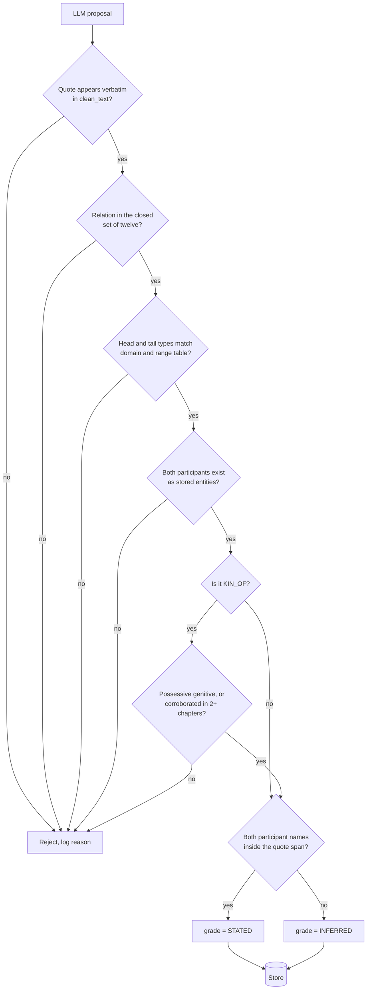
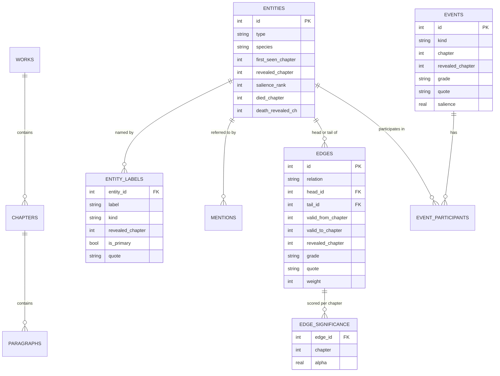
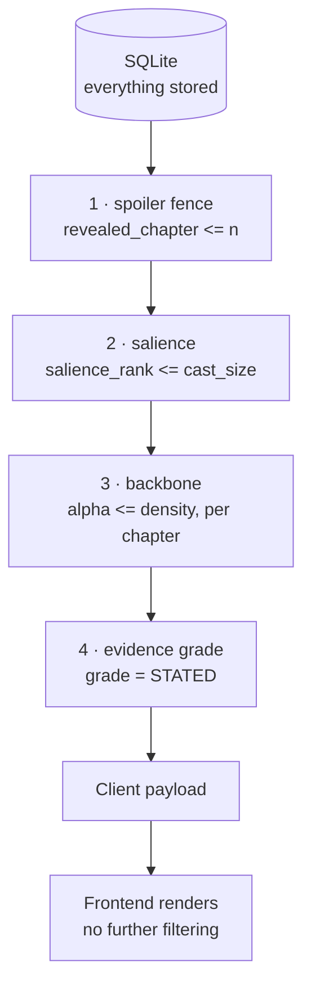

> **v2 design document. The retrofit (tag `retrofit-v1.0`) implemented a subset. See [`docs/retrofit/design/IMPLEMENTED.md`](IMPLEMENTED.md).**

# StoryWeave v2 — Architecture

**Audience:** external technical reviewer. Assumes familiarity with graphs,
databases and NLP pipelines. Assumes no prior knowledge of this project.
**Status:** design, pre-implementation. Nothing here is built yet.
**Companions:** `ONTOLOGY.md` (what is extracted), `EVALUATION_PLAN.md` (how it
is measured).

Diagrams are Mermaid and render natively on GitHub.

---

## 1. What the system does

StoryWeave reads a serialized web novel and builds a knowledge graph of its
characters, factions, places and items — but **fenced to a reader's progress**.
A reader at chapter 25 sees only what the text has revealed by chapter 25.
Nothing later is hidden in the UI; it is never sent to the client at all.

The claim under test: **spoiler exclusion is a data-layer property, not a
presentation choice.**

---

## 2. Why v2 exists — the v1 failure, measured

v1 shipped and was reviewed by two people. Both found it unreadable. The
measurements explain why.

| Measurement | v1 at chapter 40 |
|---|---|
| Nodes served to client | 206 |
| Edges served to client | 1316 |
| Node types drawn simultaneously | 8 |
| Server-side importance filtering | none |
| Client-side filtering | lowercase-label heuristic + min-degree |

Root cause, stated plainly: **every named thing became a node, and every
co-mention became an edge.** Nothing was excluded, so the graph was a transcript
rather than a summary.

Three further defects were found by the measurement harness and are recorded in
`evidence/BASELINE.md`:

1. **Parallel-edge collapse.** `build_graph` projected into `nx.DiGraph`, which
   cannot hold parallel edges. 1326 fenced rows were served as 1316 — ten edges
   silently dropped between the database and the client by a data-structure
   choice, not by the fence.
2. **Identity relabelling.** That collapse could overwrite one relation type with
   another. A `SECRET_IDENTITY` edge was relabelled `REINCARNATION`.
3. **The cast filter was a no-op.** The "Principal / Everyone" toggle produced
   identical output at every chapter. The apparent 206→157 reduction came
   entirely from node-type drops, not from any notion of importance.

v2's design is a response to each of these. Where a design decision exists to
prevent a specific measured defect, this document says so.

---

## 3. System overview



Four things to note before the detail.

**Storage is unconditional.** Everything extracted is stored, including material
that will never be drawn. Filtering happens at query time. This is deliberate:
re-extraction is slow, filter tuning must be instant, and before/after
measurement requires both the filtered and unfiltered sets to exist.

**Scoring is a separate offline pass** that writes back into the database.
Salience ranks and per-chapter edge significance are precomputed columns, not
runtime computation.

**The validator sits between the model and storage.** Nothing an LLM emits
reaches the database without passing schema checks in code.

**The frontend does no filtering.** Everything the client receives is everything
the client may see. v1 filtered in the browser; that is what made its safety
property unverifiable.

---

## 4. Stage 0 — text normalisation



### Why this stage exists

Source text carries deliberate anti-scraping contamination. Real examples from
the corpus:

```
even tone:<novelsnext> I think you should take a look at </novelsnext>
ndαsnοvεl.cοm Morgan looked away from Nephis
```

The second uses **Greek homoglyphs** — `α` is U+03B1, not Latin `a`; `ο` is
U+03BF, not Latin `o`. A naive cleaner regex on `[a-z]` misses it entirely.

Untreated this produces: broken sentence segmentation, verbatim-quote checks
failing on valid extractions, and watermark fragments entering NER output as
proper nouns.

### Two rules that are easy to get wrong

**Store both texts; index into the cleaned one.** If quote spans index into raw
text, every future improvement to the cleaner invalidates every stored quote and
every annotation reference.

**Quotation marks carry semantics.** In the corpus:

| Mark | Meaning | Counts as interaction |
|---|---|---|
| `" "` | Spoken aloud | yes |
| `' '` | Internal monologue | **no** — one speaker, no interaction |
| `[ ]` | Telepathy | yes |

The cleaner must not collapse `'` into `"` and must not strip brackets.
Internal monologue proves presence but creates no edge; speech and telepathy do.
Collapsing them corrupts the salience signal.

---

## 5. Extraction pipeline



### Design notes

**Two-stage cost control.** GLiNER is cheap and runs over everything; the LLM is
expensive and sees only candidate sentences plus two sentences of context.

**Death gets two detectors.** A ~70-verb lexicon across seven semantic groups
(direct violence, battle, execution, attrition, consumption, mass, euphemism)
acts as a fast filter, and GLiNER zero-shot with a `"death event"` label acts as
a recall net for phrasings the lexicon misses. Death is the most frequent
consequential event in serialized fiction and it cascades through the graph, so
it justifies a dedicated path.

**Coreference is deliberately off the critical path.** v2 ships STATED-only
output. A STATED claim requires both participants named in the quote, so there is
no pronoun to resolve. Coreference feeds only salience mention counts. This
places the pipeline's weakest component where its failure cannot damage the
default output.

Published work on literary character networks found that high-recall,
lower-precision coreference produces many spurious co-occurrences that actively
harm the analysis. The filter here is: accept a coreference cluster only if it
contains at least one proper-name mention; discard all-pronoun clusters.

**The LLM is given a closed vocabulary.** Twelve relation types, ten event kinds.
If a fact does not fit, the model emits nothing. v1 used open-vocabulary
extraction and produced relation partners like `Ascent-related paperwork`.

---

## 6. The validator

This is the most important component in the system. It is the reason an LLM can
be used at all without the output being unauditable.



### The domain and range table

C = Character, O = Organization, P = Place, I = Item.

| Relation | Head | Tail | Symmetric |
|---|---|---|---|
| `KIN_OF` | C | C | no |
| `ROMANTIC_WITH` | C | C | yes |
| `ALLY_OF` | C, O | C, O | yes |
| `ENEMY_OF` | C, O | C, O | yes |
| `SERVES` | C | C, O | no |
| `MENTOR_OF` | C | C | no |
| `KILLED` | C | C | no |
| `SAME_AS` | C | C | yes |
| `MEMBER_OF` | C | O | no |
| `LEADS` | C | O, P | no |
| `OWNS` | C, O | I | no |
| `LOCATED_IN` | C, O, P | P | no |

`LEADS(tax rolls, outer hall)` has an Item head and a Place tail. Rejected by
lookup, before storage. This is a table, not a heuristic.

### The `KIN_OF` branch

Kinship words are among the most metaphorically abused words in fiction. Sworn
comrades say "brother". Religious orders say "sister". Mentors are "father".

Real case from the corpus, said to an unrelated person:

> *"Am I not blessed to suddenly get such a wonderful little sister?"*

A naive extractor produces a `KIN_OF` edge with a perfect STATED quote, and it is
wrong. The guard requires either a **possessive genitive** — "Sorrel's father",
"his niece" — where the kin word attaches grammatically to the other party, or
**corroboration across two separate chapters**. A vocative in dialogue is
insufficient.

Check: *"The Saint looked at his niece"* passes. *"such a wonderful little
sister"* is blocked.

### Evidence grading

| Grade | Rule |
|---|---|
| STATED | The quote contains the participant names **and** the relation word. The quote alone proves the claim to someone who has read nothing else. |
| INFERRED | Anything requiring coreference or cross-sentence assembly. |

A counter-example that must grade INFERRED:

```
summary: "Thessaly hands the Ninth House ledgers to Vesper."
quote:   "She set the ledgers down without looking at him."
```

The quote names nobody. On a novel nobody has read, there is no way to
distinguish model comprehension from model hallucination. v2 ships STATED only;
the INFERRED path is not built.

---

## 7. Data model



### Weight, not duplicates

If two entities are connected in chapters 1, 7, 14 and 22, that is **one edge
with weight 4**, not four edges.

This is the structural fix for measured defect 1. With no parallel edges in the
data model, there is nothing for a `DiGraph` projection to collapse, and defect 2
— relation relabelling caused by that collapse — cannot occur. The defect is
removed by design rather than patched.

`weight` also feeds the backbone filter.

### Labels are a table, not a column

One entity, many names, each with the chapter the reader learns it. This single
mechanism solves three separate problems:

| Problem | Example |
|---|---|
| Abbreviation | "Anvil of Valor" / "the Anvil" / "Valor" — one entity, three labels |
| Late naming | "the thing in the well" (ch. 3) becomes "Gravewyrm" (ch. 19) |
| Title as reference | "the Warden" linkable to Thessaly only from ch. 19 |

Display picks the most recent label the reader has earned:

```sql
SELECT label FROM entity_labels
WHERE entity_id = :id AND revealed_chapter <= :n
ORDER BY revealed_chapter DESC LIMIT 1;
```

So a node's *name changes as the slider moves*. A reader at chapter 5 sees "the
thing in the well"; at chapter 25 the same node reads "Gravewyrm".

**The abbreviation merge rule** is the risky part, because substring matching is
how wrong merges happen. A candidate merges only if it is a contiguous
word-subsequence of the full name, the full form appeared first or in the same
chapter, they occur within a small chapter window, it is not a stop-word
fragment, and — the load-bearing condition — **the short form does not already
match a different entity's full name**. If a book contains a character named
Valor and an item called Anvil of Valor, that last condition keeps them separate.

When ambiguous, do not merge. A false merge destroys a distinction the reader can
see; a false split only adds a node. Splits are recoverable.

---

## 8. The three chapter numbers

Every edge carries three chapter fields. They mean different things, and this is
the part of the schema most likely to hide a bug.

| Field | Meaning |
|---|---|
| `valid_from_chapter` | When the fact became true in the story |
| `valid_to_chapter` | When it stopped being true. NULL = still true. |
| `revealed_chapter` | When the reader is permitted to know it |

**The invariant, applied to every table:**

> `revealed_chapter` = the chapter of the quote that proves the fact. Never
> earlier. Where several quotes prove it, the earliest qualifying one.

### The death case

This is the trap. A character dies in chapter 22; the reader is told in chapter
27.

```
died_chapter:       22
death_revealed_ch:  27     <- the fence reads this
```

Reading `died_chapter` would show the character as dead five chapters before the
reader is told. It is a spoiler leak with a different shape from the usual kind,
and it has a dedicated test case in the evaluation plan.

### Death cascade

Death is the one relationship-ending event v2 extracts, and it comes nearly free:

```
When died_chapter is set for entity X:
    for every edge touching X whose relation can end:
        if valid_to_chapter IS NULL:
            valid_to_chapter = died_chapter
```

Closable: `SERVES`, `ALLY_OF`, `ROMANTIC_WITH`, `MEMBER_OF`, `LOCATED_IN`.
Not closable: `KIN_OF`, `KILLED` — you remain someone's brother after death.

Textual relationship endings that are not deaths are **out of scope for v2** and
documented as a limitation. Extracting when a relationship *ends* from prose is
substantially harder than extracting that it exists.

---

## 9. Query layer



All four are clauses of a **single SQL query**:

```sql
WHERE e.revealed_chapter  <= :n            -- 1 safety
  AND s.chapter            = :n
  AND s.alpha             <= :density      -- 3 display
  AND ent.salience_rank   <= :cast_size    -- 2 display
  AND e.grade              = :grade_filter -- 4 display
```

**Filter 1 is a safety property. Filters 2 to 4 are display preferences.** They
are kept as visibly distinct clauses precisely so the safety property remains
auditable. Mixing them would make it impossible to state what the fence
guarantees.

### Salience

Computed once after extraction, stored as a column, never at runtime.

Features: lifetime mention count, **recent** mention count, chapter spread, has a
proper name, speaks dialogue, is the subject of verbs, graph centrality. Each
normalised to 0–1, equal weights, summed, then **ranked**.

Three design choices worth challenging:

**Rank, not score threshold.** A score threshold behaves differently on a
20-chapter novel and a 200-chapter one and needs retuning per book. "Top 20"
means the same thing everywhere.

**Recency is a separate feature.** On a 1000+ chapter serial, lifetime mention
count alone fills the top 20 with characters from the first 300 chapters — some
long dead. Lifetime and recent counts both feed the score.

**No LLM judgement of importance.** Published work found LLMs achieve high recall
but poor precision on salience, labelling nearly every entity as salient. The
features are countable and auditable instead.

### Backbone

Disparity filter (Serrano et al., 2009), computed on edge `weight`.

Why not a global weight threshold: a global cutoff erases minor characters
entirely, because *all* their edges are weak. The disparity filter evaluates each
edge relative to its own node's other connections, so a minor character retains
their single significant tie.

**Computed per chapter, not once.** This is correctness, not optimisation. The
filter judges an edge against its node's degree, and degree changes with chapter.
At chapter 10 a node has 3 edges; at chapter 40 it has 20. The same edge is
significant in one and noise in the other. Alphas are precomputed per chapter at
ingest and stored in `edge_significance`.

---

## 10. What the reader sees

The graph is **not** the landing page in v2. v1's first-contact failure was a
direct consequence of opening onto a node-link diagram.

| View | Role |
|---|---|
| **Timeline** | Primary surface. Per-character rows, grouped by chapter, filterable by event kind and salience. |
| Cast page | Landing page. Cards for the principal cast. |
| Dossier | Per-entity detail. Ties as a list. Carried forward from v1 — this page worked. |
| Ego graph | 1 hop, ~12 nodes, edge labels on |
| Full graph | Advanced view, not the front door |

Default graph state: **Characters only**, cast size 20, STATED only, backbone
applied. Organization, Place and Item are overlay toggles, off by default.

Rationale for character-only default: node-type heterogeneity was the primary
driver of visual density, and which non-character types matter is
genre-dependent. Every narrative has people and ties between them. A romance has
no meaningful items; a progression fantasy does. Rather than hard-coding four
equal types, the system defaults to one and lets the reader add complexity.

---

## 11. Deliberate exclusions

Things a reviewer might expect to see, and why they are absent.

| Excluded | Reason |
|---|---|
| `TALKS_TO`, `MEETS`, `APPEARS_WITH` relations | Co-occurrence in disguise. This was v1's hairball. Dialogue is used as a *feature* feeding salience and edge weight, never as its own edge type. |
| `BETRAYS` as a relation | An event, not a standing state. Boundary rule: if you cannot say "X is currently Y's ___", it is an event. |
| Separate `PARENT_OF` / `SIBLING_OF` / `SPOUSE_OF` | Collapse into `KIN_OF` with a role attribute. Six extra relations would halve per-type sample size. |
| Any client-side filtering | Makes the safety property unverifiable. This is v1's actual architecture and v2's most direct reversal. |
| Trained models | Nothing is trained. GLiNER and the LLM are used zero-shot. There is therefore no loss curve and no train/test split. |
| Cloud API as default | Local Ollama is the default backend. The system must run with no internet and no API key. OpenRouter exists as an optional config flag. |

### Scope boundaries for v2

Dialogue attribution, the INFERRED extraction path, full textual relationship
endings, LitBank benchmarking, metric/distance backbone comparison, gendered kin
inverses, glossary page, desktop packaging, and full-length serial processing are
all v3.

Validation is on **40-chapter windows** of two works: *The Ninth House*
(translated register) and *Shadow Slave* (native English, contrasting
conventions). Full-length processing of 1000+ chapter serials is not attempted.

---

## 12. Questions for the reviewer

Specific points where an outside opinion would change the design.

**1. Backbone choice.** The disparity filter is the primary method, with
metric/distance backbone parked as future work. For a *character network*
specifically — sparse, hub-dominated, growing monotonically — is disparity the
right choice, or does the connectivity guarantee of the metric backbone matter
more here?

**2. Per-chapter significance.** Recomputing alphas at every chapter means the
same edge can be in the backbone at chapter 20 and out at chapter 40. That is
intended — the graph reflects a reader's state — but it means edges can visibly
disappear as the slider advances. Is that defensible, or is monotonic-only
growth a better invariant?

**3. Salience weighting.** Equal-weighted, normalised, ranked. Hand-tuned once
against four annotated chapters, then frozen. With a corpus this small, learning
the weights seemed worse than a simple explainable scheme. Is that the right
call, or is there a principled weighting that does not need training data?

**4. The three chapter numbers.** `valid_from`, `valid_to`, `revealed` per edge.
This is where subtle spoiler leaks would hide. Is there a simpler
representation that preserves the same guarantees?

**5. Where the fence sits.** It is the first clause of the query that builds the
payload. Is there an argument for pushing it lower — into a view, or row-level
security — so that a future code path cannot accidentally bypass it?

---

## 13. Glossary

| Term | Meaning |
|---|---|
| **Spoiler fence** | The `revealed_chapter <= n` filter. The project's central claim. |
| **Salience** | Computed importance of an entity. Determines whether it earns a node. |
| **Backbone** | The statistically significant subset of edges, via disparity filter. |
| **STATED / INFERRED** | Evidence grade. STATED means the quote alone proves the claim. |
| **Ego graph** | A single node plus its 1-hop neighbourhood. |
| **Cast dial** | UI control setting `cast_size`: Principal 20 / Extended 50 / Everyone. |
| **Overlay** | Optional node type — Organization, Place, Item — off by default. |
| **Stage 0** | Text normalisation, before any extraction. |
| **Weak zero** | A correct result whose failure mode was never stressed. Labelled as such rather than reported as proof. |

---

*Design document. No implementation exists at time of writing. Measurements
quoted for v1 are from `evidence/EVAL_V1.md` and `evidence/BASELINE.md`.*
