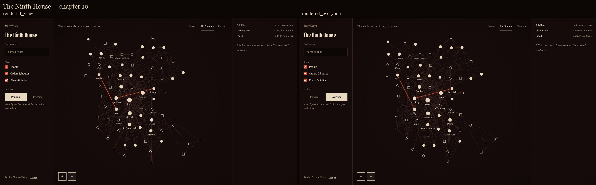
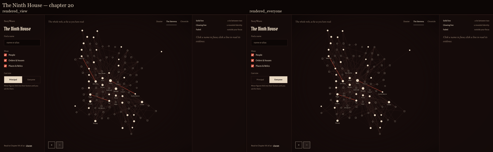
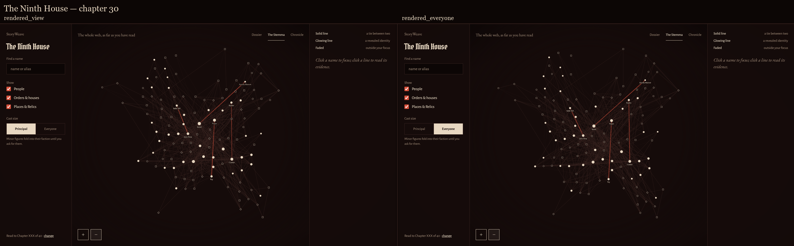
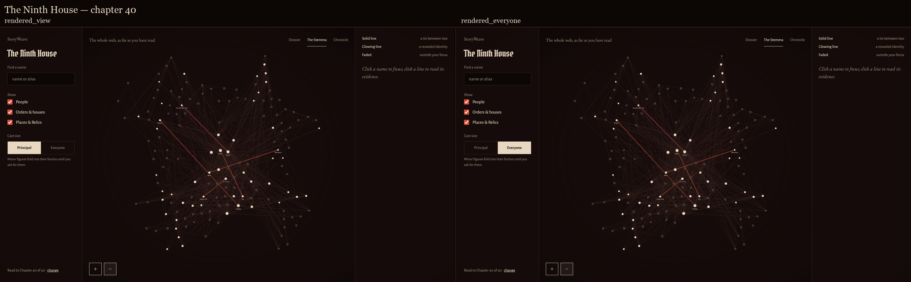
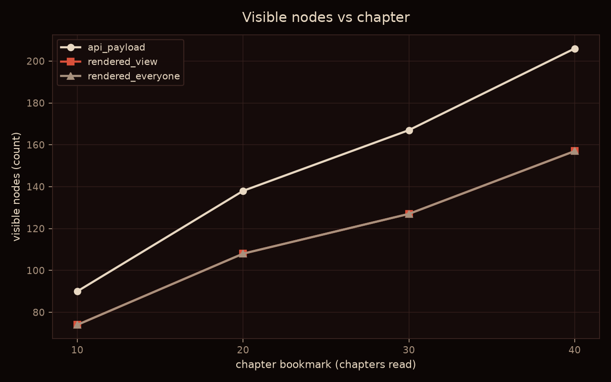
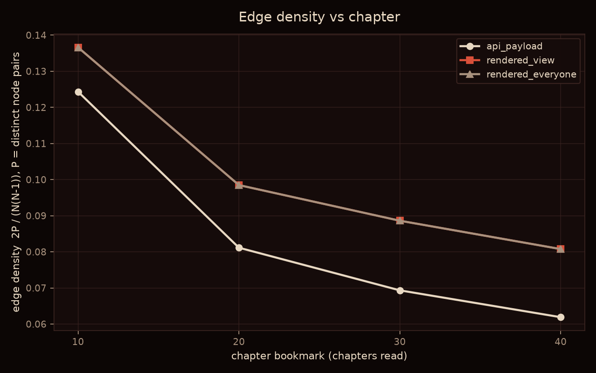
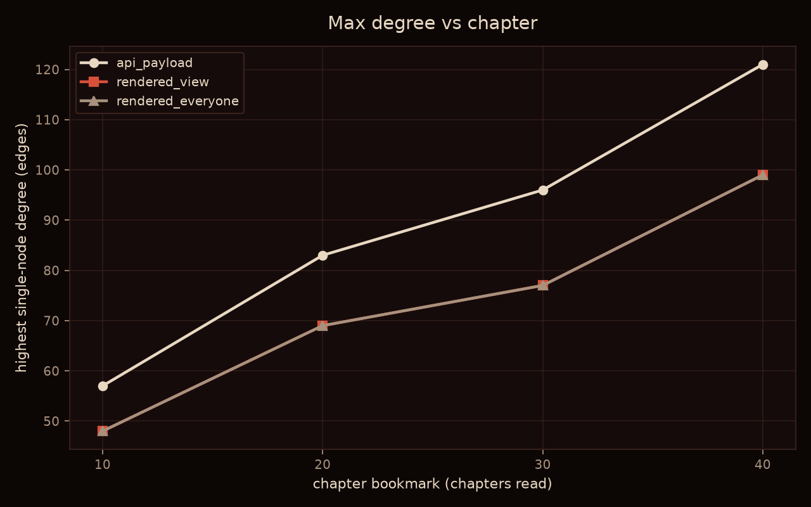

# StoryWeave — graph density evidence

Work: `the-ninth-house` · chapters measured: 10, 20, 30, 40 of 40 · generated by `tools/run_evidence.py`.

All values below are measured. Nothing here is estimated or interpreted; a value that could not be computed is written as "not measured".

## Metrics

### `api_payload`

| chapter | nodes | edges | mean deg | median deg | max deg | density | isolated | degree-1 |
| --- | --- | --- | --- | --- | --- | --- | --- | --- |
| 10 | 90 | 503 | 11.1778 | 9.0 | 57 | 0.124345 | 0 | 0 |
| 20 | 138 | 774 | 11.2174 | 8.5 | 83 | 0.081138 | 0 | 1 |
| 30 | 167 | 970 | 11.6168 | 8.0 | 96 | 0.069331 | 0 | 2 |
| 40 | 206 | 1316 | 12.7767 | 8.0 | 121 | 0.061899 | 0 | 1 |

Node counts by type:

| node_type | ch 10 | ch 20 | ch 30 | ch 40 |
| --- | --- | --- | --- | --- |
| Ability | 3 | 4 | 4 | 5 |
| Character | 32 | 41 | 44 | 53 |
| Concept | 8 | 14 | 19 | 21 |
| Event | 5 | 11 | 16 | 22 |
| Item | 13 | 20 | 24 | 28 |
| Organization | 5 | 9 | 13 | 16 |
| Place | 21 | 34 | 42 | 55 |
| Title | 3 | 5 | 5 | 6 |

Edge counts by relation:

| relation | ch 10 | ch 20 | ch 30 | ch 40 |
| --- | --- | --- | --- | --- |
| ALIAS | 1 | 2 | 2 | 2 |
| AffiliatedWith | 3 | 4 | 5 | 8 |
| HasAbility | 9 | 14 | 14 | 17 |
| HasTitle | 14 | 22 | 23 | 26 |
| LeaderOf | 25 | 32 | 44 | 58 |
| LocatedIn | 119 | 202 | 250 | 347 |
| MemberOf | 9 | 24 | 38 | 58 |
| Mentor | 2 | 3 | 3 | 3 |
| OwnsItem | 47 | 67 | 86 | 115 |
| Parent | 1 | 2 | 2 | 2 |
| ParticipatedIn | 31 | 54 | 78 | 113 |
| Protects | 0 | 0 | 1 | 1 |
| REINCARNATION | 0 | 0 | 1 | 2 |
| RelatedTo | 236 | 341 | 415 | 556 |
| Respects | 1 | 1 | 1 | 1 |
| Rival | 1 | 1 | 1 | 1 |
| SECRET_IDENTITY | 1 | 2 | 2 | 1 |
| Serves | 2 | 2 | 3 | 3 |
| Sibling | 1 | 1 | 1 | 1 |
| TRANSMIGRATED_INTO | 0 | 0 | 0 | 1 |

### `rendered_view`

| chapter | nodes | edges | mean deg | median deg | max deg | density | isolated | degree-1 |
| --- | --- | --- | --- | --- | --- | --- | --- | --- |
| 10 | 74 | 369 | 9.973 | 8.0 | 48 | 0.136616 | 0 | 0 |
| 20 | 108 | 569 | 10.537 | 8.0 | 69 | 0.098477 | 0 | 0 |
| 30 | 127 | 709 | 11.1654 | 8.0 | 77 | 0.088614 | 0 | 0 |
| 40 | 157 | 989 | 12.5987 | 8.0 | 99 | 0.080761 | 0 | 0 |

Node counts by type:

| node_type | ch 10 | ch 20 | ch 30 | ch 40 |
| --- | --- | --- | --- | --- |
| Ability | 3 | 4 | 4 | 5 |
| Character | 32 | 41 | 44 | 53 |
| Item | 13 | 20 | 24 | 28 |
| Organization | 5 | 9 | 13 | 16 |
| Place | 21 | 34 | 42 | 55 |

Edge counts by relation:

| relation | ch 10 | ch 20 | ch 30 | ch 40 |
| --- | --- | --- | --- | --- |
| ALIAS | 1 | 1 | 1 | 1 |
| AffiliatedWith | 3 | 4 | 5 | 8 |
| HasAbility | 9 | 14 | 14 | 17 |
| LeaderOf | 25 | 32 | 44 | 58 |
| LocatedIn | 119 | 202 | 250 | 347 |
| MemberOf | 9 | 24 | 38 | 58 |
| Mentor | 1 | 1 | 1 | 1 |
| OwnsItem | 47 | 67 | 86 | 115 |
| Parent | 1 | 2 | 2 | 2 |
| REINCARNATION | 0 | 0 | 1 | 2 |
| RelatedTo | 152 | 219 | 264 | 377 |
| SECRET_IDENTITY | 1 | 2 | 2 | 1 |
| Sibling | 1 | 1 | 1 | 1 |
| TRANSMIGRATED_INTO | 0 | 0 | 0 | 1 |

### `rendered_everyone`

| chapter | nodes | edges | mean deg | median deg | max deg | density | isolated | degree-1 |
| --- | --- | --- | --- | --- | --- | --- | --- | --- |
| 10 | 74 | 369 | 9.973 | 8.0 | 48 | 0.136616 | 0 | 0 |
| 20 | 108 | 569 | 10.537 | 8.0 | 69 | 0.098477 | 0 | 0 |
| 30 | 127 | 709 | 11.1654 | 8.0 | 77 | 0.088614 | 0 | 0 |
| 40 | 157 | 989 | 12.5987 | 8.0 | 99 | 0.080761 | 0 | 0 |

Node counts by type:

| node_type | ch 10 | ch 20 | ch 30 | ch 40 |
| --- | --- | --- | --- | --- |
| Ability | 3 | 4 | 4 | 5 |
| Character | 32 | 41 | 44 | 53 |
| Item | 13 | 20 | 24 | 28 |
| Organization | 5 | 9 | 13 | 16 |
| Place | 21 | 34 | 42 | 55 |

Edge counts by relation:

| relation | ch 10 | ch 20 | ch 30 | ch 40 |
| --- | --- | --- | --- | --- |
| ALIAS | 1 | 1 | 1 | 1 |
| AffiliatedWith | 3 | 4 | 5 | 8 |
| HasAbility | 9 | 14 | 14 | 17 |
| LeaderOf | 25 | 32 | 44 | 58 |
| LocatedIn | 119 | 202 | 250 | 347 |
| MemberOf | 9 | 24 | 38 | 58 |
| Mentor | 1 | 1 | 1 | 1 |
| OwnsItem | 47 | 67 | 86 | 115 |
| Parent | 1 | 2 | 2 | 2 |
| REINCARNATION | 0 | 0 | 1 | 2 |
| RelatedTo | 152 | 219 | 264 | 377 |
| SECRET_IDENTITY | 1 | 2 | 2 | 1 |
| Sibling | 1 | 1 | 1 | 1 |
| TRANSMIGRATED_INTO | 0 | 0 | 0 | 1 |

## Comparison plates

Left: `rendered_view`. Right: `rendered_everyone`. Full-graph view, no focus.

**Chapter 10**

**Chapter 20**

**Chapter 30**

**Chapter 40**

## Growth plots

## Live DOM cross-check

Node and edge counts read from the live Cytoscape instance at the moment each screenshot was taken, against the computed metrics for the same configuration and chapter.

| label | chapter | view | DOM nodes | DOM edges | CSV nodes | CSV edges | match | zoom |
| --- | --- | --- | --- | --- | --- | --- | --- | --- |
| rendered_view | 10 | full | 74 | 369 | 74 | 369 | yes | 0.7439 |
| rendered_view | 10 | ego | 74 | 369 | 74 | 369 | yes | 1.2000 |
| rendered_view | 20 | full | 108 | 569 | 108 | 569 | yes | 0.5415 |
| rendered_view | 20 | ego | 108 | 569 | 108 | 569 | yes | 1.2000 |
| rendered_view | 30 | full | 127 | 709 | 127 | 709 | yes | 0.4765 |
| rendered_view | 30 | ego | 127 | 709 | 127 | 709 | yes | 1.2000 |
| rendered_view | 40 | full | 157 | 989 | 157 | 989 | yes | 0.3864 |
| rendered_view | 40 | ego | 157 | 989 | 157 | 989 | yes | 1.2000 |
| rendered_everyone | 10 | full | 74 | 369 | 74 | 369 | yes | 0.7439 |
| rendered_everyone | 10 | ego | 74 | 369 | 74 | 369 | yes | 1.2000 |
| rendered_everyone | 20 | full | 108 | 569 | 108 | 569 | yes | 0.5395 |
| rendered_everyone | 20 | ego | 108 | 569 | 108 | 569 | yes | 1.2000 |
| rendered_everyone | 30 | full | 127 | 709 | 127 | 709 | yes | 0.4553 |
| rendered_everyone | 30 | ego | 127 | 709 | 127 | 709 | yes | 1.2000 |
| rendered_everyone | 40 | full | 157 | 989 | 157 | 989 | yes | 0.3864 |
| rendered_everyone | 40 | ego | 157 | 989 | 157 | 989 | yes | 1.2000 |

## Measurement conditions

**Both configurations come from the same codebase and the same database. No rebuilt system has been measured. There is no "v2" in this run — these are two points in one pipeline, not two versions of the app.**

- Repository commit (identical for every configuration measured here): `6fda8e9b56df51114b0cd4d2932a3184ee130e1e (working tree dirty at run time)`
- Database: `storyweave-demo.sqlite` (opened `mode=ro`; never written by this harness)
- Work measured: `the-ninth-house` — every figure is scoped to this work alone
- Chapters: 10, 20, 30, 40 (of 40)
- Viewport: 1600x900 CSS px at deviceScaleFactor 2 (PNG 3200x1800)
- Browser: Chromium via Playwright `channel="chrome"` (system Chrome; no browser downloaded)
- Ego-view focus node: `Sorrel`

### Filters active per configuration

- **`api_payload`** — Spoiler fence only. `query/fence.py` -> `repository.list_nodes_revealed` (`revealed_chapter <= N`) and `repository.list_edges_revealed` (edge AND both endpoints revealed, enforced in SQL). No other filter is applied; this is the payload the API sends to the client.
- **`rendered_view`** — Spoiler fence, then the frontend's client-side view filters as drawn by the Stemma: (1) `buildViewModel` drops Concept/Event nodes to 'Also mentioned' and drops Title/unknown types entirely; (2) it drops any identity edge with no `evidence_span` (the R8 citation gate); (3) it merges parallel edges on the unordered node pair, an identity edge absorbing a social/structural one; (4) `visibleGraph` with cast='principal' keeps a node only when degree >= 2 OR it touches an identity edge OR it is the focus; (5) edges are then kept only when both endpoints survived.
- **`rendered_everyone`** — Spoiler fence, then the same `buildViewModel` stage as `rendered_view` -- Concept/Event dropped to 'Also mentioned', Title/unknown dropped, uncited identity edges dropped, parallel edges merged on the unordered pair -- but `visibleGraph` with cast='everyone', which applies NO degree or identity cast-reduction: every drawable node is kept. This is the widest view the app can actually render, and the screenshot counterpart of `api_payload`.

### Parameters the task asked for that do not exist in this codebase

- **Salience rank / salience cast size:** not measured. There is no salience ranking in this codebase. The only cast control is the Stemma's two-state toggle (`principal` / `everyone`), measured as `rendered_view` and `rendered_everyone`; it takes a mode, not a size.
- **Disparity filter alpha:** not measured. No disparity or backbone filter exists in this codebase, so no alpha was in effect.

### Renderability

- `api_payload` is measured in the tables above but has **no screenshot**: the app has no view that draws the unfiltered payload, so capturing one would have meant inventing a view that does not exist.
- `rendered_view` is rendered with the Stemma cast toggle set to `principal`.
- `rendered_everyone` is rendered with the Stemma cast toggle set to `everyone`.

